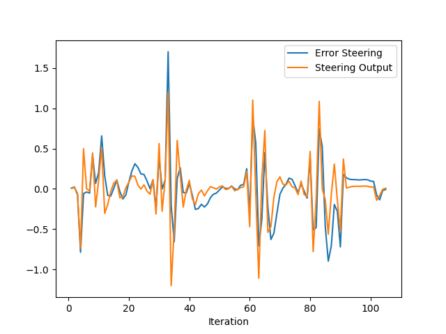
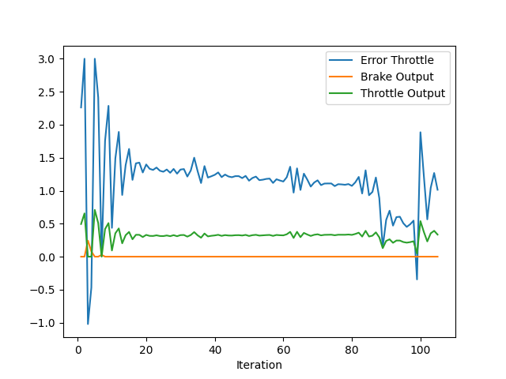

* Add the plots to your report and explain them (describe what you see)  
  - The following figure shows the steering error and steering output. There are four parts of the timeline where the error becomes extremely large, these happened when the vehicle was avoiding a car in front of it and had to change its path. The oscillation also influences the error curve will require tweaking of the parameters.  
  
  - The following figure show continuous osciallation in error throttle which will not provide smooth experience requires further adjust parameters.  
  
* What is the effect of the PID according to the plots, how each part of the PID affects the control command?    
  - We need PID controller doesn't overshoot and minimizes the error in a short range of time. PID controller can minimize the mistake between expect and actual speed / yaw angle of the vehicle by producing control output. Within this project the PID parameters were adjust to keep the drive smooth. 
  
  - P is a proportional controller that provides an output proportional to the current error. P controller compares the set point with the actual value or the reference and the resulting error is multiplied with a proportional constant to get the output and requires biasing to provide stable operation and always maintains the steady-state error.
  - I is an integral controller that helps to reduce time to minimize the error. It integrates the error signal over a certain period of time until the error signal is down to zero. This controller decreases the output when a negative error takes place. As the gain of the I- Controller decreases, the steady-state error also decreases.
  - D is a derivative controller for ease of the error rate to reduce the overshooting and improves the stability of the system by compensation increasing the derivative, gain increases the speed of the response.   
     
* How would you design a way to automatically tune the PID parameters?
  - Implementing twiddle algorithm to optimize a set of  parameters which was covered in PID control Parameter Optimization lesson. By offering initial values for the PID parameters and probing intervals we can run the PID controller and analyze the control output and tweaking the parameters up and down by examining the outcome, calculates the new quality marker and replaces the parameters only if the result is better.

* PID controller is a model free controller, i.e. it does not use a model of the car. Could you explain the pros and cons of this type of controller?   
  - Pros: PID controller can run in real-time making it idealized for self-driving cars no need to understand the system, adapted to a complex system, computationally more efficient. It's broadly known and widely used within the industry like temperature and ph control. Temperature control of Furnace which is used for heating at high temperatures has a high quantity of inertia to moderately stable signal for fault detection. PH control is widely viewed in the industry as to control.
PID Controllers are mostly used in converters. and can be connected to numerous distinctive issues, not only steering and throttle control. 
  - Cons: The only disadvantage is the tuning methodology. Difficult interpretation of the controller’s behaviour, cannot predict how the system will react to an unknown situation. Tuning or learning the controller using data can be slow. Uncertainty of the controller (no guarantees)  
* (Optional) What would you do to improve the PID controller?   
  - PID controller should be fine-tuned by attempting different scenarios with higher speeds and dividing a few ranges of speed that would utilize diverse parameters.  

### Result:    
[https://youtu.be/0PO0DbaaFKI](https://youtu.be/0PO0DbaaFKI)  

